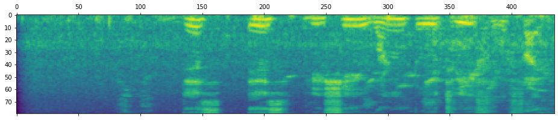
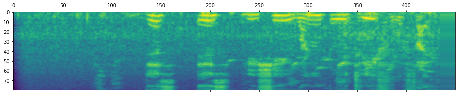
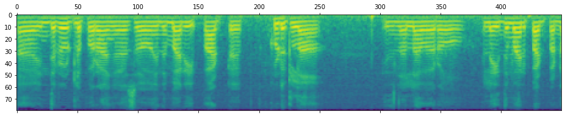
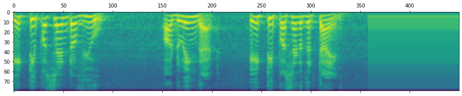

<h1 align="center">A Lightweight Approach Towards<br>Speaker Authentication Systems</h1>

<p align="center">
  <a href="https://www.techrxiv.org/doi/full/10.36227/techrxiv.170327084.43364748/v1"></a>
  <a href="https://www.python.org/downloads/"></a>
  <a href="https://www.tensorflow.org/"></a>
  <a href="https://pytorch.org/"></a>
  <a href="https://librosa.org/"></a>
  <a href="LICENSE"></a>
</p>

<p align="center">
  <b>Rishi More</b> · <b>Sahil Deshmukh</b> · <b>Krishi Chawda</b> · <b>Dhruv Mistry</b><br>
  <i>Department of Computer Engineering, K.J. Somaiya Institute of Technology</i><br>
  <i>Guided by Prof. Abhijit Patil</i>
</p>

<p align="center">
  <a href="https://www.techrxiv.org/doi/full/10.36227/techrxiv.170327084.43364748/v1"><b>Preprint</b></a> ·
  <a href="documentation/ALightweightApproachTowardsSpeakerAuthenticationSystems.pdf"><b>Paper (PDF)</b></a> ·
  <a href="notebooks/Wav_to_Spectograms.ipynb"><b>Notebook</b></a> ·
  <a href="https://www.kaggle.com/datasets/gaurav41/voxceleb1-audio-wav-files-for-india-celebrity"><b>Dataset</b></a>
</p>

---

> **TL;DR** — We present a lightweight Siamese neural network for **text-independent, language-agnostic speaker verification** that encodes mel spectrograms into compact 512-dimensional embeddings. The model achieves **95.52% training accuracy** and **96.62% test accuracy** with only **~1.66M parameters**, making it suitable for deployment on resource-constrained edge devices.

---

## Overview

Traditional authentication methods (passwords, PINs) are increasingly supplemented by biometric alternatives. Voice-based authentication offers a natural, hands-free mechanism — but existing systems often require heavyweight models and large storage per user.

This project introduces a **lightweight speaker verification pipeline** that:

- Converts raw audio to **mel spectrograms** using an optimised preprocessing pipeline with globally cached Hann windows and mel filter-banks
- Extracts compact **512-dim speaker embeddings** via a convolutional encoder
- Verifies speaker identity through **L1 (Manhattan) distance** in the Siamese framework
- Operates on **language-agnostic acoustic features**, enabling cross-lingual verification
- Requires only a **single stored embedding per user** (~2 KB), dramatically reducing per-user infrastructure cost

---

## Key Results

| Metric        | Score   |
|:--------------|:--------|
| **Precision** | 98.8%   |
| **Recall**    | 94.2%   |
| **F1 Score**  | 96.5%   |
| **Train Acc** | 95.52%  |
| **Test Acc**  | 96.62%  |

> The model was trained on the [VoxCeleb1 Indian](https://www.kaggle.com/datasets/gaurav41/voxceleb1-audio-wav-files-for-india-celebrity) subset and evaluated across three architectural variants with different parameter budgets (900K, 1.4M, 3M).

---

## Architecture

The model follows a two-module Siamese design:

### Embedding Network (Tail)

The encoder maps an 80×450 mel spectrogram to a 512-dimensional embedding vector through three convolutional blocks with progressively extracted hierarchical features.

<p align="center">
  
  <br><i>Fig 1. Embedding (Tail) network architecture — visualised with VisualKeras</i>
</p>

```
Input (80 × 450 × 1)
  │
  ├─ Conv Block 1:  3 × Conv2D(32, 4×20, ReLU) → Dropout(0.3) → MaxPool(2×2)
  ├─ Conv Block 2:  3 × Conv2D(64, 4×20, ReLU) → Dropout(0.3) → MaxPool(2×2)
  ├─ Conv Block 3:  3 × Conv2D(32, 4×20, ReLU) → Dropout(0.3) → MaxPool(2×2)
  │
  ├─ Flatten
  └─ Dense(512, sigmoid)  →  Embedding Vector
```

### Siamese Head

```
┌──────────────┐    ┌──────────────┐
│  Audio A     │    │  Audio B     │
│ (80 × 450)   │    │ (80 × 450)   │
└──────┬───────┘    └──────┬───────┘
       │                   │
  ┌────▼────┐         ┌────▼────┐
  │Embedding│         │Embedding│    (shared weights)
  │ Network │         │ Network │
  └────┬────┘         └────┬────┘
       │                   │
       │512-dim     512-dim│
       │                   │
       └───────┬───────────┘
               │
         ┌─────▼──────┐
         │ L1 Distance│
         │  |a - b|   │
         └─────┬──────┘
               │
         ┌─────▼──────┐
         │ Dense(1,σ) │
         └─────┬──────┘
               │
          Same / Different
```

**Total Parameters:** 1,658,753 (Embedding: 1,658,240 + Head: 513)

---

## Mel Spectrogram Pipeline

Raw audio is transformed into fixed-size 80×450 mel spectrogram matrices through the following pipeline:

1. **Load & trim** — Read WAV at 22,050 Hz; trim silence above 60 dB
2. **Normalise** — Peak-normalise to 95% amplitude
3. **STFT** — 1024-point FFT, 256-sample hop, Hann window (globally cached)
4. **Mel mapping** — 80 mel bands, 0–8,000 Hz range (filter-bank cached)
5. **Log compression** — Dynamic range compression via `log(clamp(x))`
6. **Pad / crop** — Standardise to 80×450 (mean-pad short clips; crop long ones)

<p align="center">
  
  <br><i>Fig 2. Raw mel spectrogram before padding (variable width)</i>
</p>

<p align="center">
  
  <br><i>Fig 3. Mel spectrogram after padding to 80×450</i>
</p>

<p align="center">
  
  <br><i>Fig 4. VoxCeleb speaker spectrogram — Speaker A</i>
</p>

<p align="center">
  
  <br><i>Fig 5. VoxCeleb speaker spectrogram — Speaker B (different vocal patterns)</i>
</p>

---

## Getting Started

### Prerequisites

- Python 3.8+
- CUDA-compatible GPU (recommended for training)

### Installation

```bash
git clone https://github.com/rishi-more-2003/voice-authentication.git
cd voice-authentication
pip install -r requirements.txt
```

### Dataset

Download the [VoxCeleb1 Indian](https://www.kaggle.com/datasets/gaurav41/voxceleb1-audio-wav-files-for-india-celebrity) dataset and place the audio files under `data/vox_indian/`:

```
data/vox_indian/
├── id10002/
│   ├── 0_laIeN-Q44/
│   │   ├── 00001.wav
│   │   ├── 00002.wav
│   │   └── ...
│   └── ...
├── id10003/
│   └── ...
└── ...
```

---

## Usage

### 1. Preprocess Audio

Convert raw WAV files to mel spectrograms and build the training pair CSV:

```bash
python preprocess_dataset.py --src data/vox_indian --dst data/spectrograms --csv data/spec_dataset.csv
```

### 2. Train the Model

```bash
python train.py --csv data/spec_dataset.csv --epochs 10 --batch-size 128 --lr 0.01
```

Training logs are saved to `logs/` and can be visualised with TensorBoard:

```bash
tensorboard --logdir logs
```

### 3. Run Inference

Verify whether two audio clips belong to the same speaker:

```bash
python predict.py --audio1 samples/speaker_a.wav --audio2 samples/speaker_b.wav --threshold 0.5
```

**Output:**

```
==================================================
  Similarity score : 0.9823
  Threshold        : 0.5
  Result           : SAME speaker
==================================================
```

### Configuration

All hyperparameters are centralised in [`config.py`](config.py):

```python
AUDIO_CONFIG = {
    "sample_rate": 22050,
    "n_fft": 1024,
    "n_mels": 80,
    "frame_length": 1024,
    "frame_shift": 256,
    "mel_fmin": 0,
    "mel_fmax": 8000,
    "spec_width": 450,
    "spec_height": 80,
}
```

---

## Project Structure

```
voice-authentication/
│
├── config.py                    # All hyperparameters and path settings
├── train.py                     # Training entry point
├── predict.py                   # Inference / speaker verification
├── preprocess_dataset.py        # WAV → spectrogram + pair CSV generation
├── requirements.txt             # Python dependencies
│
├── src/                         # Core library
│   ├── __init__.py
│   ├── preprocessing.py         #   Audio → mel spectrogram pipeline
│   ├── model.py                 #   Siamese network + L1Dist layer
│   ├── data.py                  #   Dataset generation & batch loader
│   └── utils.py                 #   Plotting & file helpers
│
├── documentation/               # Research paper
│   └── ALightweightApproach...  #   Published paper (PDF)
│
├── notebooks/                   # Exploratory work
│   └── Wav_to_Spectograms.ipynb #   Original development notebook
│
└── figures/                     # Architecture & spectrogram figures
    ├── architecture.png
    ├── mel_spectrogram.png
    ├── mel_spectrogram_raw.png
    ├── mel_spectrogram_padded.png
    ├── mel_spectrogram_voxceleb.png
    └── mel_spectrogram_speaker2.png
```

---

## Model Variants

Three model configurations were explored during development:

| Variant | Parameters | Training Samples | Notes                              |
|:--------|:-----------|:-----------------|:-----------------------------------|
| Small   | ~900K      | 1M               | Highest sample count, compact arch |
| Medium  | ~1.4M      | 100K             | Balance of capacity and data       |
| Large   | ~3M        | 10K              | Largest model, smallest dataset    |

The **Medium** variant (1.4M params, 100K samples) achieved the best trade-off between accuracy and computational cost.

---

## Key Contributions

1. **Lightweight Architecture** — A Siamese CNN with only ~1.66M parameters that achieves competitive verification accuracy, suitable for edge deployment.

2. **Efficient Preprocessing** — Globally cached Hann windows and mel filter-banks eliminate redundant computation, reducing preprocessing latency.

3. **Compact Embeddings** — Each user requires only a single 512-dimensional embedding (~2 KB) for enrolment, drastically cutting per-user storage costs.

4. **Language Independence** — The system uses acoustic features (mel spectrograms) rather than linguistic features, enabling verification across languages.

---

## Citation

If you use this work, please cite:

```bibtex
@article{more2024lightweight,
  title     = {A Lightweight Approach Towards Speaker Authentication Systems},
  author    = {More, Rishi and Deshmukh, Sahil and Chawda, Krishi and Mistry, Dhruv and Patil, Abhijit},
  journal   = {TechRxiv},
  year      = {2024},
  doi       = {10.36227/techrxiv.170327084.43364748/v1},
  url       = {https://www.techrxiv.org/doi/full/10.36227/techrxiv.170327084.43364748/v1},
  note      = {Department of Computer Engineering, K.J. Somaiya Institute of Technology}
}
```

---

## Acknowledgements

- **[VoxCeleb](https://www.robots.ox.ac.uk/~vgg/data/voxceleb/)** — Large-scale speaker verification dataset
- **[Librosa](https://librosa.org/)** — Audio analysis library for Python
- **[TensorFlow / Keras](https://www.tensorflow.org/)** — Deep learning framework
- **[PyTorch](https://pytorch.org/)** — Tensor computation and mel spectrogram pipeline
- **[VisualKeras](https://github.com/paulgavrikov/visualkeras)** — Architecture visualisation

---

<p align="center"><i>Made with care at K.J. Somaiya Institute of Technology, Mumbai</i></p>
